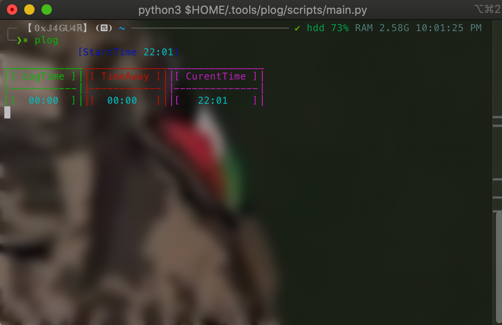

# PLOG

A script that calculate the spent while the screen is open and not locked for 1337 to know the log time without the need to logout and check the discord bot `emet` you can just lock the screen and log back in then you while see the time spent loged in and the time spent on lockscreen as followes



## Instalation

To install the script you can runthe following commands in your terminal

```bash
    git clone git@github.com:jaguar-ks/Plog.git
    cd Plog
    ./setup.sh
```

## Usage

You can run it on the terminal when you login as followes:

```bash
    plog
```

> **NB:** Note that the script will take the curente terminal tab or window to display the time table
